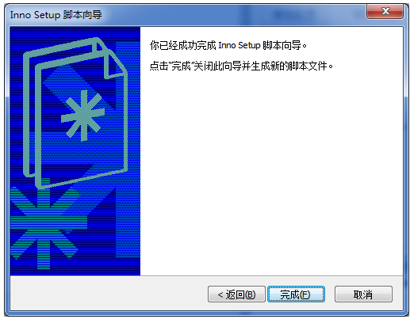

# 桌面软件的一般打包方式

# 一、 inno setup


Inno Setup 是什么？InnoSetup 是一个免费的 Windows 安装程序制作软件。第一次发表是在 1997 年，Inno Setup 今天在功能设置和稳定性上的竞争力可能已经超过一些商业的安装程序制作软件。inno Setup 是一个免费的安装制作软件，小巧、简便、精美是其最大特点，支持pascal脚本，能快速制作出标准Windows风格的安装界面，足以完成一般安装任务。该软件用Delphi写成，其官方网站同时也提供源程序免费下载。它虽不能与Installshield这类[恐龙](http://www.pc6.com/pc/klyxdq/)级的安装制作软件相比，但也当之无愧算是一款优秀的打包工具。支持现在所有正在使用的Windows版本。

Inno setup还具有以下一系列显著特点。支持创建单个EXE 格式的安装程序，使你的程序可以很方便地在网络上发表。同时也支持磁盘延伸。标准的Windows样式向导界面。定制安装类型，例如：完整安装，最小安装，自定义安装。完整的卸载功能。文件安装:包括完全的“压缩”支持，bzip2 和 7-Zip LZMA 文件压缩。安装程序可以比较文件版本信息，替换正在使用的文件，使用共享文件计数，注册DLL/OCX 和类型库，以及安装字体。在任何地方都可以创建快捷方式，包括在“开始”菜单和桌面上。创建注册表 和.INI 条目。在安装之前、之中或之后可运行其他程序。支持多语言安装。支持密码和加密安装。支持数字签名的安装和卸载，包括双重签名（SHA1和SHA256）。后台安装和后台卸载。Unicode安装。完整的Pascal脚本引擎选项于运行期高级自定义安装和卸载。完整的源代码可从[GitHub获得](https://github.com/jrsoftware/issrc)。


 

下面以inno setup 5.5.5为例，介绍软件的打包。

1、安装 inno setu完成后，找到该软件→ “Inno Setup 5” → “ Inno Setup” ，运行 Inno Setup 编译器；


2、在弹出的“欢迎” 对话框中点击 “取消”，便可看到 Inno Setup 编译器的主界面

 

3、按向导完成打包，在主界面菜单中，点击 “文件” → “新建”

 

 

4、在弹出的 “Inno Setup 脚本向导” 对话框中点击 “下一步”

 


 

5、 在弹出的 “应用程序信息” 对话框里填写要制作程序 “安装包” 信息，点击“下一步” 弹出 “应用程序文件夹”。

 


 

6、“应用程序文件夹” 对话框如下图，一般默认即可

 


7、点击“下一步” 弹出 “应用程序文件” 对话框，点击 “应用程序主执行文件(M)” 下的 “浏览”按钮，选择相应的应用程序主执行文件（TCP调试助手(V1.9).exe）。

再点击 “添加文件夹”按钮，在弹出的 “浏览文件夹”对话框选择要封装文件夹，单击“确定”。


在弹出的“配置”对话框中点击“是”按钮


8、选中“ E:\TCP调试助手\* ” ，点击 “编辑”按钮，便可定义刚才添加的文件夹制作成 “安装包” 之后的安装路径，一般默认即可。


 

9、选择完成后点击 “确定” ，然后点击 “下一步” ，弹出 “应用程序图标” 对话框，勾选 “在开始菜单文件夹中创建卸载图标（U）”。


点击 “下一步” ，弹出 “应用程序文档” 对话框，均可为空。


 

完成之后点击 “下一步” 弹出 “安装语言” 对话框，根据需要勾选语言


 

10、完成之后点击 “下一步” 弹出 “编译设置” 对话框。


 

点击 “下一步” 弹出 “Inno Setup 预处理器” 对话框。


 

点击 “下一步” 弹出 “你已经成功完成 Inno Setup 脚本向导”。



 

点击 “完成” ，弹出 “Inno Setup 编译器” 提示窗口。


 

11、编译脚本

在前面 “Inno Setup 编译器” 提示窗口中选择 “是” ，或者在主菜单 “构建” → “编译”。

 

 

12、脚本代码示例


 

至此简单的就打包完成了。


 

 

 

 

# 二、InstallShield

Installshield是一个强大和易于使用，用于解决Windows软件安装包开发的制作工具。用它可以以传统MSI方式和虚拟格式，自动化地封装、捆绑和包装你的产品。IntallShield能使你的用户在决定何时何地何方式管理和部署你的应用程序时，得到一个最时尚舒畅的安装体验。是Microsoft Windows平台上应用程序安装打包领域，使用最广泛和市场认可度最高的一款安装打包工具软件，支持Windows（客户版本及服务器版本），Web服务和移动设备。对于软件开发人员来说，Installshield是一个非常优秀的工具，但其使用过于繁琐与庞杂。

  首先是Installshield的下载与安装。非重点，不再赘述。InstallShield 2018是一款“恐龙级别”的安装包制作工具，是 Flexera Software 的当家产品。这不仅是因为它已经拥有20多年的研发历史，而且它也是全球著名的软件公司的“皇家御用”打包软件，比如 Adobe、Corel、Autodesk 等大公司，它们的软件安装包都是使用这款软件制作的。然而这款打包软件过于专业，且只有英文版本，并不像 Inno Setup、NSIS 等打包软件那样容易入门，所以想学习必须下苦功夫才行。这也是全球领先的Windows安装开发解决方案，现在已经成为Windows Installer和InstallScript安装方面的行业标准。InstallShield 2018 可以帮助所有规模的软件生产商创建高质量的安装，并使其可以配置数据库服务器、Web 服务以及移动设备。是软件安装、配置软件包和升级解决方案领域内公认的标准，一贯支持最新的技术和工业标准，使您可以制作更加可靠的安装程序，有效提高了软件的安装成功率。下面以最新的InstallShield 2018为例对软件打包进行进行介绍。

1、新建安装工程 New Porject，在file-New新建工程，项目类型选择Base MSI Project。


2、填写应用程序信息(Application Information)

 填写公司名称、应用程序名称、版本号、公司网站、选择安装包和卸载程序的图标。

 


 

3、 添加应用程序的依赖库（Installtion Requirement）。

 


 

4、安装依赖库前需要先下载依赖库到本地。选择上面的Installation Designer -进入Application Data-Redistributables。


选择右键选择下载就可以。


5、 添加应用程序（Application Files）。


 

选择完文件之后，请选中全部的文件右键赋予更新覆盖权限（Allways Overwrite）。这个功能是升级的时候覆盖使用。不需要升级覆盖的可以去掉勾选。

 


 

6、 添加快捷方式（Application Shortcuts）

 

 

 

设置完成后跳转到Other Places中的快捷方式（Shortcuts）


 

 

设置桌面快捷方式的目标应用程序位置。选择Desktop右键添加快捷方式

 

 

 

 

选择目标应用程序。


 


7、 编译打包（菜单Build）

编译完后，打开打包后的存放目录即可。


 

 

# 三、HofoSetup

HofoSetup是一款专业的软件[安装包制作](http://www.wmzhe.com/heji/anzhuangbaozhizuo)工具，通俗的说就是[打包工具](http://www.wmzhe.com/heji/ruanjiandabaogongju)，功能全面，实用简单，无需任何复杂的脚本操作，用户只需填写简单的软件信息和设置即可一键将安装程序精致打包。HofoSetup可以快速的制作安装程序，并且还支持添加多种炫酷效果，你可以自定义安装程序的保存路径，可以修改默认安装的路径，支持导入注册表文件，用户可以通过本软件，快速的制作出漂亮的安装程序。

安装程序一键制作，简单就是硬道理，只需填写简单的软件信息，只需进行简单的设置，一键即可打包成精美的安装程序。极速安装，免除漫长的等待，超快的安装速度，让您用户不再等待漫长的安装过程。一键闪装，炫酷效果，超强的视觉体验，给用户最抢眼的视觉冲击，安装过程从此变成一种享受，好的体验为您带来更多的用户量。

 

由于Hofosetup使用起来十分简单，下面简要介绍其使用。

1、打开Hofosetup，在界面的上方可自定义相关内容:
 1)软件名称:
 2)软件版本:
 3)简短描述:

2、选择安装的风格图片，可选择Hofosetup的预设的风格，也可自定义,自定义只需点击“自定义栏”然后点击“+”标志即可添加图片，但是需注意一次只允许添加5张图片，同时图片尺寸不得高于560乘330。

3、Hofosetup允许用户进行以下操作:
 1)选取打包目录
 2)从打包目录选取主程序
 3)自定义扩展程序或脚本
 4)选择安装程序保存路径
 5)修改修改默认安装路径
 6)添加自定义快捷方式
 7)导入注册表文件
 8)检测并配置安装环境
 可勾选:
 1)创建开始菜单项
 2)创建[桌面图标](http://www.wmzhe.com/heji/zhuomiantubiao)
 3)安装完启动主程序
 4)生成静默安装程序

4、完成以上操作点击“一键打包”即可完成程序的打包。

 

# 四、Advanced Installer

Advanced Installer是款符合MS Windows认证的[安装包制作](http://www.wmzhe.com/heji/anzhuangbaozhizuo)工具，同样使用简单，无需用户学习任何脚本方面的知识，用户只需添加文件，修改名称，添加按钮就可以了，轻松构建可靠的MSI软件包，安装、更新和配置产品。

具有完全安装、注册和[卸载](http://www.wmzhe.com/heji/xiezairuanjian)组成你应用程序的文件、部件及资源的功能，完全自定义 MSI 安装包 。具有添加、删除文件及文件夹功能，可以添加或移除内、外部文件或 URL 快捷方式， 添加或移除注册表键或项目，添加或移除环境变量。安装时可设置[文件属性](http://www.wmzhe.com/heji/wenjianshuxingxiugaiqi)只读、[隐藏](http://www.wmzhe.com/heji/yincangruanjian)等。

强制安装完毕系统重启动，支持使用64位CPU的系统中安装包制作。 Windows 系统下安装过程完整[日志](http://www.wmzhe.com/heji/rizhiruanjian)，支持 Java 应用程序。旧版本自动升级，支持合并模块的安装制作和对话框编辑，支持[数据库](http://www.wmzhe.com/heji/shujukuruanjian)安装，可以自定义菜单快捷方式的安装位置。支持安装控制面板小程序，支持从安装前后的[镜像](http://www.wmzhe.com/heji/jingxiangruanjian)中制作安装包。可以导入其他 MSI 和 Visual Studio 工程。以下简单演示打包过程。

1.新建一个安装工程


 


 


2.详细的设置工程文件

设置产品信息以及在控制面板里的一些信息

 


设置程序的安装参数


 这里满重要的，可以在这里设置譬如自动同步文件夹内容，卸载软件的相关设置，设置快捷方式，注册文件什么的，下面依次说明：

a.卸载软件相关的设置


 

b.自动同步文件夹内容

 


c.设置快捷方式


d.注册文件（在要注册的文件上右击选择【属性】）


D．程序安装完以后显示自述文件或者默认启动


Advanced Installer添加卸载快捷方式：

用Advanced Installer打包的程序安装后点击安装包就可以选择修复或者卸载,为了方便和完整,经常需要在菜单里添加卸载的快捷方式.如下:

新建快捷方式向导 -- 该程序包卸载程序 -- 选择图标 ,然后在应用程序快捷方式文件夹中找到快捷方式,拖到开始菜单对应新建的文件夹即可.先选择应用程序快捷方式文件夹，在上面工具栏找到添加快捷方式按钮，下拉中有卸载选项,按向导操作即可

 

 

# 五、NSIS

NSIS（Nullsoft Scriptable Install System）是一个[开源](http://www.wmzhe.com/heji/kaiyuanceshigongju)的 Windows 系统下小巧高效的安装程序制作工具。NSIS提供了安装、[卸载](http://www.wmzhe.com/heji/xiezairuanjian)、系统设置、文件[解压缩](http://www.wmzhe.com/heji/jieyasuoruanjian)等功能。这如其名字所指出的那样，NSIS 是通过它的脚本语言来描述安装程序的行为和逻辑的。NSIS 的脚本语言和通常的编程语言有类似的结构和语法，但NSIS是为安装程序这类应用所设计的。

 nsis 是“nullsoft 脚本安装系统”(nullsoft scriptable installation system) 的缩写，它是一个免费的 win32 安装、卸载系统，采用了简洁高效的脚本方式。它本来是一个由 nullsoft 创建并用于作为 winamp 及其插件发布的系统，但现已被上百个应用程序所应用，作为它们进行程序发布的工具。

　　nsis 创建的安装程序可以进行安装、卸载、设置系统设置、解压文件等等。几乎可以做所有事情。因为它基于脚本文件，所以您可以完全控制您的安装程序的每个部分。它的脚本语言支持变量、函数、字串处理，就像是一个普通的程序语言 - 但其仅设计用来创建安装程序。

　　简体中文增强版除了主程序的[翻译](http://www.wmzhe.com/heji/fanyiruanjian)之外还把主要的文档作了翻译并修正了官方版本里简体中文语言习惯用语不合适之处。单纯的使用脚本来编写安装程序对于大多数人来说不仅困难而且容易出错，为此，简体中文增强版里集成了一个相当好用的[脚本编辑](http://www.wmzhe.com/heji/jiaobenbianji)器 - vnisedit 增强版 (build 060712 by restools)。只需要根据向导就能轻松的做出很酷的安装程序，甚至，您还可以在向导里给您的安装程序添加启动画面、让您的安装程序在安装过程中播放音乐，而这，只需要点几下鼠标即可。除此之外，vnisedit 附带的注册表转换插件还可以把 .reg 文件一次性的转换为 nsis 脚本，[补丁制作](http://www.wmzhe.com/heji/budingzhizuo)向导可以一次性地为您生成体积超小的补丁升级程序。简体中文增强版还在官方版本的基础上集成了一些有用的插件，比如 findproc 可以根据可执行文件名查找进程是否在运行，这在制作补丁程序或者[汉化](http://www.wmzhe.com/heji/hanhuaruanjian)包时非常有用。由于各个组件在使用时各自独立，所以强烈推荐安装全部组件。

 

# 六、electron打包桌面应用程序

  Electron是用html，css，JavaScript来构建跨平台桌面应用的一个开源库。Electron通过将Chromium和node合并在同一个运行时环境中，并将其打包为Mac，Windows和linux系统下的应用来实现这一目的。

  如果你可以建一个网站，你就可以建一个桌面应用程序。 Electron 是一个使用 JavaScript, HTML 和 CSS 等 Web 技术创建原生程序的框架，它负责比较难搞的部分，开发者只需把精力放在你的应用的核心上即可。

 

使用eletron前需要储备哪些知识

1)首先需要熟练掌握前端的基础知识html,css，js

2)有一定的node基础，知道npm怎么用

下面我们从electron的安装开始，了解下electron。

1、electron安装

1)npm命令安装electron库：

```
npm install electron --save-dev --save-exact
```

2)查看是否安装成功，输入以下命令：

```
electron -v
```


2、electron入门实例

该实例的使用方法如下：

1)从GitHub上下载实例代码：

git clone https://github.com/electron/electron-quick-start


2)进入到electron-quick-start目录下

```
cd electron-quick-start
```


目录结构如下：


3)安装项目依赖

```
npm install
```


4)启动项目：

```
npm start
```


出现如下界面，说明项目运行成功


官方的这个仓库给我们初始化了一个electron项目，结构非常纯净，接下来就可以直接改造成自己的项目了。

 

关于如何改造成自己的项目，非本文重点，此处便不再赘述。要得到一个桌面级应用程序，接下来便需要对项目进行打包。

 

 

安装electron打包工具electron-packager

```
npm install electron-packager -g
```

 

配置打包命令

```
"scripts": {

"start": "electron .",

"pack": "electron-packager . myClient --win --out ../myClient --arch=x64 --app-version=0.0.1 --electron-version=2.0.0"

}
```

 

命令结构如下（根据实际情况修改）：

“.”：需要打包的应用目录（即当前目录），

“myClient”：应用名称，

“--win”：打包平台（以Windows为例），

“--out ../myClient”：输出目录，

“--arch=64”：64位，

“--app-version=0.0.1”：应用版本，

“--electron-version=2.0.0”：electron版本

执行打包命令：

npm run pack

 

打包完成后，找到输出目录，打开打包完成后的文件夹，

 

 


 

可以看到生成了.exe的执行文件以及其他的一堆配置文件，双击myClient.exe就可以打开应用程序了。

现在，我们已经得到了应用程序的绿色版本（无需安装，拷贝整个文件目录之后即可使用），但是作为客户端应用程序，我们更希望能直接得到一个安装包，安装之后通过桌面快捷方式的形式去访问，这时候就需要Inno Setup出场了。

接下来，再来回顾以下Inno Setup的安装与使用

下载安装Inno Setup

下载地址：https://pc.qq.com/detail/13/detail_1313.html

安装完成以后打开Inno Setup客户端

a. file->new，新建脚本

 


 

b.填写应用程序信息，黑体为必填项

Application name： 应用名称； 

Application version：应用版本；

Application publisher：发行单位（可选）；

Application websiter：应用程序网址（可选）；


c.完善应用文件信息

Application destination base folder：应用程序目标基本文件夹，可默认也可自定义；

Application folder name：应用文件夹名称；

Allow user to change the application folder：勾选，允许用户自定义安装位置；


d.指定属于应用程序的文件

Application main executable file：应用程序主执行文件，即第8步中打包生成的.exe文件；

Allow user to start the application after Setup has finished：允许用户在安装完成后启动应用程序；

Add folders：添加应用程序文件，选择第8步中打包出的文件根目录即可，要把所有.dll文件及其他配置文件都包含进去；


点击添加之后可以看到：


文件目录以自己的实际情况为准。

e.指定应用程序的快捷方式，勾选默认的两项即可，即“创建主执行程序的快捷方式到公共开始菜单程序文件夹”、“允许用户创建桌面快捷方式”


f.指定安装期间要显示的文档文件

License file：许可文件；

Information file shown before installation：安装之前显示信息文件；

Information file shown after installation：安装之后显示信息文件；


g.指定应包括的安装语言（汉化版的有简体中文选项），选择之后点击下一步


h.指定基本编译设置

Custom compiler output folder：自定义编译器输出文件夹，即最终编译出的安装包要放哪个位置；

Compiler output base file name：编辑器输出基本文件名，即安装包名称；

Custom Setup icon file：自定义安装程序图标文件；

Setup password：安装密码；


i.点击下一步


剩下的就是一路确定了，会询问你在编译之前要不要保存你的脚本（上面的配置步骤，最终会生成一个编译脚本文件），点击保存，先不要编译，打开脚本文件，新增配置项，修改注册表，设置开机自启动：


[Registry]

Root: HKLM; Subkey: "SOFTWARE\Microsoft\Windows\CurrentVersion\Run"; ValueType: string; ValueName: "testrun"; ValueData: "{app}\{#MyAppExeName}"

然后，执行编译文件：build->compile


至此，打包完成。

 

 

# 七、MacOS打包dmg文件

   MacOS系统下dmg格式软件包的制作一般分为两步，软件包的制作与整理和压缩整合。所使用的工具，终端和磁盘工具。下面进行详细介绍。

1.1、在终端中输入

```
ln -s /Applications/ ~/Desktop
```

  命令

生成Applications快捷方式，为软件打包作准备。终端与磁盘工具如下图所示。


 

1.2、生成空白映像

  打开 `磁盘工具 －> 文件 －> 新建映像 －> 空白映像`


依次填写相应的信息，名称即为打包软件的名称，大小应大于软件的大小。

1.3、配置背景图。首先打开显示选项，然后进行配置。


1.4、隐藏背景即简介图片

在终端输入如下指令

```
chflags hidden AppBg.png

chflags hidden Icns.icns
```

1.5、压缩整合 

磁盘工具–>映像–>转换

填写相关配置信息，即可完成打包。


