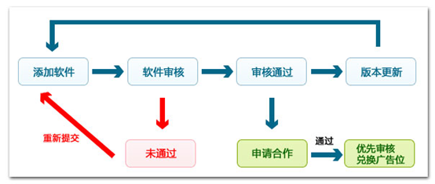

 

# 软件宝库

# 一、Microsoft store

## 1 现状

微软商店是很多正版微软用户会青睐的一个应用下载平台，由于国内盗版软件横行，应用分发平台众多，缺乏管理，过去的很多下载站为了盈利，开始走向“流氓式”的发展道路，软件全家桶随处可见，同时随着用户对于个人隐私安全以及电脑使用安全的重视，微软商店已经开始逐渐走入大家的视野，但是由于微软商店生态的匮乏，并且微软商店为了适应软件在所有设备多平台的使用，并且改变传统windows软件良莠不齐的软件设计，要求发布软件必须是UMP应用，但是在目前阶段，由于微软在移动设备领域的失利，UMP应用并没有成为多数应用开发商的首选，与传统的.exe应用相比，UMP应用相对显得比较单薄，软件功能不够完整，在国内依然不是主流的软件分发平台。

链接：https://docs.microsoft.com/zh-cn/windows/uwp/publish/

                               

## 2 发布流程

### 2.1 创建开发者账号

2.1.1 请在[注册页](https://go.microsoft.com/fwlink/p/?LinkId=615100)**上**，选择 "注册"。

2.1.2如果尚未使用 Microsoft 帐户登录，请立即登录，或创建新的 Microsoft 帐户。 此处使用的 Microsoft 帐户用于登录开发人员帐户。

2.1.3选择您所在的[国家/地区](https://docs.microsoft.com/zh-cn/windows/uwp/publish/account-types-locations-and-fees#developer-account-and-app-submission-markets)或业务所在的位置。 你将无法在以后更改此设置。

2.1.4选择[开发者帐户类型](https://docs.microsoft.com/zh-cn/windows/uwp/publish/account-types-locations-and-fees)（个人或公司）。 你之后将无法更改该设置，因此请确保选择正确的帐户类型。

2.1.5输入要使用的**发布服务器显示名称**（50个字符或更少）。 客户在浏览应用时将看到此名称，并通过此名称记住你的应用，因此请谨慎选择该名称。 对于公司帐户，请确保使用组织的注册公司名称或商标。 如果输入其他人已选择的名称，或其他人有权使用该名称，则不允许使用该名称。

**备注**

确保有权使用在此输入的名称。 如果其他人拥有所选名称的商标或版权，帐户可能会关闭。 有关详细信息，请参阅[应用开发人员协议](https://docs.microsoft.com/legal/windows/agreements/app-developer-agreement)。 如果其他人正在使用你对其持有商标或其他法定权利的发布者显示名称，请[联系 Microsoft](https://go.microsoft.com/fwlink/p/?LinkId=233777)。  

2.1.6为你的开发者帐户输入要使用的联系人信息。

**备注**

遇到帐户相关事宜时，我们将通过此信息与你联系。 例如，你将在完成注册后收到电子邮件确认。 完成此操作后，我们将在我们向你发送消息时发送消息，或者你需要通过你的帐户进行修复。 我们可能还会发送信息性电子邮件（如前文所述），除非你选择不接收非事务性电子邮件。如果要注册为公司，还需要输入将批准公司帐户的人员的姓名、电子邮件地址和电话号码。

2.1.7选择 "**下一步**" 转到 "**付款**" 部分。

输入一次性注册费用的付款信息。 如果你有涵盖注册成本的促销充值码，可以在此处进行输入。 否则，请提供信用卡信息（或支持市场中的 PayPal 信息）。 请注意，预付款的信用卡无法用于此项购买。 完成后，选择 "**下一步**" 转到 "**查看**" 屏幕。

2.1.8审查你的帐户信息并确认所有内容都正确无误。 然后，阅读并接受[应用开发人员协议](https://docs.microsoft.com/legal/windows/agreements/app-developer-agreement)的条款和条件。 选中相应的复选框，以指示已阅读并接受这些条款。

2.1.8选择 "**完成**" 以确认你的注册。 将处理你的付款，我们将向你的电子邮件地址发送一条确认消息。

注册后，你的帐户将经历验证。 对于个人帐户，我们将进行检查，确保其他用户尚未使用您的发布者显示名称。 对于公司帐户，过程所花时间会长一点，因为我们还需要确认用户得到授权，可设置公司帐户。 此验证可能需要几天到几周的时间，并且通常包含公司电话呼叫。 可在**帐户设置**页上查看验证状态

**备注**

注册开发者个人帐户约花费116元，公司帐户约花费 600元。一次性注册费，之后不会收取任何费用。edu邮箱申请免费。

### 2.2 管理账号用户

**https://docs.microsoft.com/zh-cn/windows/uwp/publish/manage-account-users**


### 2.3应用提交

[**https://docs.microsoft.com/zh-cn/windows/uwp/publish/app-submissions**](https://docs.microsoft.com/zh-cn/windows/uwp/publish/app-submissions)


# 二、腾讯开放平台（腾讯软件管理，腾讯电脑管家，QQ等）

## 1 现状

作为国内应用分发市场的巨头之一，腾讯在国内PC端应用分发市场有着举足轻重的地位，通过QQ，微信，腾讯电脑管家等应用里内置软件下载平台，依靠着即时通讯领域的巨大的流量，丰富的推广渠道，腾讯分发平台已经成为国内PC端软件开发者不可忽略的分发平台之一。同时腾讯的软件管理软件（即软件下载平台）软件资源丰富，使用方便，使得它受到很多电脑使用者的喜爱。

链接：https://wiki.open.qq.com/wiki/PC应用接入wiki索引

 

## 2 流程

 

流程总览图

### 2.1开发者管理

2.1.1开发者注册

使用QQ账号登录，推荐使用企业QQ账号，登录成功后完善公司信息或者个人信息。

2.1.2邮箱验证

### 2.2应用接入

2.2.1创建应用

选择创建应用，按提示流程完成操作。其中在选择托管模式时，开发者需要选择是“腾讯托管”还是“非腾讯托管“。

腾讯托管模式需要使用腾讯提供的云服务器，将应用部署在腾讯的服务器上，其中“腾讯托管”模式又分为单区单服和多区多服（即是否分成多个独立的、数据不互通的运行环境向用户提供服务器）。

非托管模式模式即将应用部署在自己的服务器上，而不是腾讯的服务器上。于此同时，也就无法使用腾讯提供的OPENAPI获取用户的好友信息，也不能使用腾讯云服务。

2.2.3申请资源

2.2.4查看应用属性

应用创建成功后，可查看应用被自动分配的AppID和APPkey等属性。

2.2.5完善应用信息

完善应用信息后，才能将应用上线吗，其中包括应用名称、应用分类、应用简介、图标素材、填写信任IP（针对非腾讯托管用户）、填写应用调试者信息、填写客服信息、填写平台信息并且需要签署协议：

 

2.2.6申请上线

做好以上所有的准备工作后，点击“确认申请”提交上线申请，此时应用的状态为“预上线”。

2.2.7正式上线

腾讯方确认应用是否符合规范，符合规范后，软件开发者可以点击“确认上线“，应用成功上线。

### 2.3 应用接入规范

2.3.1提交应用的前提条件

应用申请上线前，需要确认开发者资质证明是否已符合接入规范，开发者资质 


 证明检查表：

2.3.2上线流程

 

2.3.3接入周期和结果通知

符合接入规范的应用，腾讯方会在1-2个工作日内将结果通知给开发者。如果是不符合接入规范的应用，将描述具体的不符合原因。

2.3.4应用接入标准

应用开发完成后，可提交上线，但需符合接入规范，接入规范主要有以下几点：

-[应用资质材料规范](https://wiki.open.qq.com/wiki/应用资质材料规范)
 -[应用设计规范](https://wiki.open.qq.com/wiki/应用设计规范)
 -[应用内容规范](https://wiki.open.qq.com/wiki/应用内容规范)
 -[客服声明规范](https://wiki.open.qq.com/wiki/客服声明规范)
 -[其它接入要点](https://wiki.open.qq.com/wiki/其它接入要点)

## 3优缺点

平台大，服务完善，用户流量大，可以接入平台的账号体系，但相应的费用较高，费用主要包括平台推广费用，腾讯云使用费用等，同时软件收益需要于腾讯分发平台分成。

 

# 三、腾讯安全管家软件管家收录方法

## 1 收录标准

1）通过腾讯电脑管家安全审核；
 2) 软件功能满足用户需求，能切实解决用户问题；
 3) 软件运行稳定可靠；
 4) 尊重用户的知情权、选择权，卸载彻底；
 5) 软件用户体验友好。

存在以下情况之一的软件将不被软件管理收录：
 1) 注册资质信息为虚假伪造；
 2) 违反相关法律、法规、政策的规定；
 3) 涉及有损中华人民共和国国家安全和利益的信息；
 4) 涉及任何反动、色情、迷信、赌博、诽谤他人等违法信息；
 5) 侵犯任何人的合法权益，包括但不限于知识产权、名誉权、肖像权、商业秘密等；
 6) 存在病毒或木马特征的恶意行为；
 7) 游戏外挂；
 8) 捆绑恶意插件或流氓软件；
 9) 无法卸载彻底；
 10) 含有强制弹出广告、广告数量过多、盗刷流量等恶意推广行为；
 11) 其它影响用户使用体验的恶意行为。

## 2 邮箱发布方式

 

## 3 论坛发布方式

 

链接：https://bbs.guanjia.qq.com/?mod=viewthread&tid=664812&extra=page%3D1

在腾讯电脑管家论坛的软件游戏分享区

### 3.1准备工作

3.1.1提供软件著作权证明

3.1.2安装包为纯净包

3.1.3安装包为非静默安装，允许用户自行设置安装路径

3.1.4安装包若支持一键安装，提供下一键安装参数，参数包括：静默安装参数和修改路径参数。这样好提高软件从下载到安装的转化率。

### 3.2收录步骤

4.2.1按照软件收录格式发帖提交申请资料

4.2.2由版主对软件进行初步审核并反馈给相关工作人员

4.2.3工作人员对软件进行审核、测试，收录并同步进程于版主

4.2.4版主在软件推荐原帖同步软件收录的最终结果

### 3.3 软件推荐格式

**软件名称：
 　官方网址：
 　接口人联系方式：
 　是软件开发商还是个人：
 　软件介绍：
 　软件大小：    
 　下载链接：    
 　发布时间：
 　新增功能：
 　宣传版本号：
 　支持操作系统（含多少位）：
 　语言种类：
 　是否收费：**       **（是/否）**
    **是否包含插件：    （是，请填写捆 绑插件名称。否）**
 　**软件截图：**       **（3-5张 280\*190等比，高宽比不对会自动按比例截取）**

### 3.4其它注意事项

3.4.1 需要更新软件的用户，同时按照此贴格式发帖，只需注明“软件更新“

3.4.2 股票金融，彩票类软件，涉及IP，版权敏感的软件暂不收录

3.4.3 软件收录/更新周期1-3周，请耐心等待

 

# 四、360软件开放平台/360软件管家

## 1 现状

360软件开放平台是为软件企业和开发者提供的免费发布推广平台。通过360软件开放平台，软件开发商可以享受软件检测、发布更新、增值推广的一站式免费服务，特别是能够帮助中小软件企业和游戏厂商的产品快速让用户了解并得到推广。同时帮助广大的互联网用户能第一时间使用到优秀的软件和游戏。360依靠电脑安全管家积攒了大量的使用用户，同时通过360的安全检查检测发布软件，确保的软件的安全性，与腾讯软件管家类似，成为国内一个重要的软件分发平台。

 

链接：https://open.soft.360.cn/index.php

## 2 360软件管家收录标准

1）通过360软件开放平台安全检测；

2）软件界面清晰，安装过程简单，操作简便，运行稳定、可靠，用户体验友好；

3）软件功能满足用户需求，对用户有实际价值；

4）尊重用户的知情权、选择权，可以卸载彻底、干净，不留残余；

5）软件产品提交时必须要有软件著作权，软件名不可使用宽泛名称，需带上品牌名；

含下列情形之一的软件，不在360软件管家收录范围内

1）违反国家宪法的；

2）危害国家安全，泄露国家机密，颠覆国家政权，破坏国家统一的；

3）涉及反动、淫秽色情、赌博、暴力、凶杀、恐怖或者教唆犯罪等其他违反国家相关法律法规规定的；

4）侵犯任何人的合法权益，包括但不限于知识产权、名誉权、肖像权、商业机密等；

5）注册资质信息为虚假伪造的；

6）带有病毒/木马或者远程监控等恶意行为；

7）存在版权问题和版权争议的；

8）恶意下载器类、外挂类、刷流量骗点、恶意推广类软件；

9）安装恶意插件、捆绑流氓软件、创建无关快捷方式；

10）静默修改默认浏览器、强制修改浏览器主页、劫持搜索引擎、强设浏览器收藏夹、静默添加开机启动等静默违反用户意愿的行为；

11）诱导用户提供手机号码、身份证号等用户个人信息，导致用户经常收到骚扰诈骗电话和短信的；

12） 注册只有手机号码一种方式，不会关联第三方登录方式的；

13）有泄露用户个人信息隐患的；

14）不能修改安装目录，安装过程无法取消，强制安装与软件无关的其他软件；

15）存在无法卸载和卸载不彻底等卸载异常问题；

16）软件退出不彻底，点击退出后仍有进程继续运行；

17）身份证制作、手机号码隐藏、各类隐私监控、翻墙代理等涉及用户隐私、密码安全和违反网络安全法规的软件；

18）将主要功能链接至网站或者完全采用内嵌网页形式；

19）软件需要使用账号登录，但未提供明显注册和登录入口；

20）广告达到一定数量，影响用户使用体验的；

21）功能限制高于同类软件标准的，试用时间低于同类软件标准的；

22）个人工作室推出的浏览器、游戏盒产品；

23）使用QVOD等第三方软件进行简单修改的伪原创开发软件；

24）以游戏平台名义发布的单款游戏；

25）大文件网游客户端；

26）期货，贵金属类；

27）单一的升级程序或者补丁程序；

28）安装包与软件名称不符的；

29）控件产品、需依赖硬件产品使用的软件；

30）影响用户利益和使用体验的其他行为。

31）对于相似品牌名称的，但无法提供相关的商标注册证明。

其他说明

未通过审核的软件，我们都会标注具体原因，同时请您参照收录标准了解

## 3 软件上传流程：

注册账号——资质审核——提交软件——软件检查——享受服务

### 3.1 账号注册、资质审核

3.1.1进入360软件开放平台，注册为360普通用户。

3.1.2补充软件开发企业信息或软件开发者信息，升级为软件开放平台VIP用户

软件开发企业：

**公司全称** （如下注册信息须填写真实、一致）

1）注册账户填写的公司全称和营业执照副本、增值电信业务许可证等资质证件名称都须一致。

2）注册账户填写的公司全称和官网网址的ICP备案公司名称须一致；提交的多个网址ICP备案公司名称须一致。

ICP备案信息查询：http://www.beian.miit.gov.cn/publish/query/indexFirst.action。

**官网地址**（提交多个网址用逗号隔开）

1）提供的官网，需要有您提交软件的介绍。

2）提供的官网，需要有官方联系方式，通过该联系方式可以联系到注册人（账户审核工程师会进行电话审核）。

3）提供的官网首页，需要有ICP备案许可证号；官网网址的ICP备案公司名称和注册资质信息须一致。

 **公司资质** (请提供：《营业执照副本》等资质证件)

1）《账户注册申请书》：请认真阅读申请书信息后填写，并请公司负责人签字，加盖公司公章。

2）《营业执照副本》：请提交加盖企业公章的营业执照副本复印件，证件信息须真实、有效，企业经营须符合国家的相关法律法规。

3）经营性公司网站需要提交《增值电信业务经营许可证》；vpn或代理服务器类软件需要提交《增值电信业务经营许可证》；游戏娱乐类软件需要提交《网络文化经营许可证》；远程监控软件需要提交公安部颁发的《计算机信息系统安全专用产品销售许可证》； 从事互联网视听节目服务企业需要提交《信息网络传播视听节目许可证》。

4）请在视频中清晰展示您提供的资质原件，有助于账户快速开通。

  

个人账户注册：

**注册信息** （须清晰、一致、真实、有效）

1）开发者姓名 （请填写证件姓名的全名）。

2）注册提交身份证证件信息（需要提交手持身份证的正面头部照片，照片中能看清姓名、身份证号等信息，证件信息须真实、一致，盗用、冒用或者使用假身份证信息注册账号将不予通过）。

3）软件网址的ICP备案名称与开发者姓名一致（IP地址、共享空间、淘宝网店、论坛、博客等不能通过账户审核）；经营性软件或网站须提供税务局出具的纳税证明。

4）视频中展示的注册人头像和证件信息须清晰、一致、真实、有效。 

ICP备案信息查询：http://www.beian.miit.gov.cn/publish/query/indexFirst.action。

**软件网址**

1）提供的软件网址，需要有您提交软件的相关介绍 。

2）提供的软件网址，需要有联系方式，通过该联系方式可以联系到注册人（管理员会进行电话审核）。

3）提供的软件网址首页，需要有ICP备案许可证号；软件网址的ICP备案名称和注册人资质信息须一致。

**重复注册验证**

1）同一身份证或同一个手机号码只可以注册一个软件开放平台账户。

2）账户因上传违规软件被关闭后，重复信息注册账户不会开通。

 

### 3.2软件上传

**软件上传须知** 

登录平台后，点击"发布软件"，可以进行软件的上传操作。如果用户上传格式不正确，就只能进入人工验证流程，人工处理就会比自动验证慢很多。为了您可以更快地得到验证结果，请注意以下几点：

\1. 上传的文件应为软件的安装包或压缩包。（如：exe、rar、zip等格式）；

\2. 软件较大，需要以链接形式提交的，链接应该指向最终的文件，如http://test.360.cn/test.exe；

\3. 不要提供第三方中转链接下载。（如：跳转到××软件平台或××网盘）这些第三方的下载需要注册账号和密码，工作人员很难及时获取到您的软件；

\4. 如果文件或程序有更新，请将最新文件及时上传到软件开放平台。

\5. 软件通过检测即代表解除拦截提醒，软件管家是否收录与软件拦截无关。

### 3.3处理时长

开发者账户注册信息一般在2个工作日内审核完成。开发者提交软件审核将在24小时内完成软件检测。

## 4 优劣点：过审速度快，花费教低

 

# 五、金山毒霸/软件之家

## 1现状：

与360软件管家类似，金山通过金山毒霸以及驱动精灵在国内杀毒软件市场也占有一璧江山，依靠金山毒霸，同样在软件分发平台有一定市场，但是相对于腾讯和360，用户流量较低。

链接：http://www.ijinshan.com/intro/soft-cooperate.shtml

 


**下载站**

现状：下载站是我国互联网发展之处的产物，互联网发展之初，一方面由于政府对于互联网的监管松懈，另一方面互联网用户由于刚接触互联网，对互联网的生疏，加上WINDOWS应用本身就缺乏整合，软件生态混乱的特点。在20世纪初，下载站行业迎来了黄金期，下载站如雨后春笋般出现，不同于互联网巨头所整合的软件宝库，通过流量的巨大优势，形成了一定意义上的行业垄断，市场只有几家巨头把握，下载站则多如牛毛。由于行业竞争，下载站走向了一条与软件宝库截然不同的道路，软件宝库通过确保软件的安全性来吸引客户使用，而下载站则选择了盗版、捆绑软件、诱导安装等一系列流氓行为来欺骗PC用户安装，甚至不乏一些病毒软件，我国第一批互联网使用者深受其害。随着网民网络保护意识的加深以及正版意识的崛起，传统下载站行业走向萧条，传统下载站要么走在转型的道路上，要么就在流氓的道路越走越远，形成了一种恶性循环。据火绒安全（杀毒软件开发公司）调查，目前下载站行业内普遍存在着强行捆绑安装软件、诱导安装、再打包捆绑以及病毒软件的乱象，各大下载站要么背靠大树，抱团取暖，要么靠着盗版软件以及非法软件（如赌博、金融、游戏外挂、破解软件）支撑着最后的生命，可见随着互联网行业的规范，下载站行业最终会走向没落。以下总结了几个目前还算正常的下载站供软件开发者参考：

 

# 一、ZOL软件下载

## 1 现状：

中关村在线是影响力广泛的中文科技门户网站，PC软件下载使其业务之一，相对来说，软件库比较丰富，大多数软件库正常，但是一些小众软件依然存在流氓软件的情况。ZOL依靠其IT门户网站，用户流量有一定保证。

 

链接：http://xiazai.zol.com.cn/author/login.php

## 2 要求

#### 2.1 实名认证

#### 2.2 工信部备案的官方网站

#### 2.3 需提交营业执照以及身份证照片

## 3 发布流程：

#### 3.1 注册登陆

#### 3.2 实名认证

#### 3.3 注册审核

#### 3.4 发布软件

## 4相关问题

#### 4.1发布软件

同一软件名称且同一版本号软件，不能重复发布。如需更新，请进入后台更新管理页面，变更版本号后提交。如版本号不变，系统默认为此软件已经存在，不能继续执行操作。

#### 4.2下载地址

请仔细查看软件提交、软件更新页面，下载地址格式要求。下载地址必须有官方网址下载地址，还可提供一个其他下载地址，有利于系统抓取。

#### 4.3修改软件

软件提交后，需要修改其名称、内容、大小、下载地址等项目时，必须变更版本号。同版本号软件不能重复提交。

#### 4.4审核时间

软件提交后，1-2个工作日内，有相关管理人员审核软件，请及时查看审核状态提示。

#### 4.5更新软件

已在ZOL软件应用下载平台发布成功的软件，可以在更新页面，变更版本号更新其软件信息。

## 5 相关收费

发布软件免费，相关推广需要收费

## 6 总结

审核期短，审核力度小，收费低，用户信任度不如软件宝库高，流量客观。

 

# 二、太平洋下载

## 1现状：

与中关村在线一样，同属IT类门户网站，软件下载是其业务之一，凭借着IT媒体讯息业务，拥有比较客观的用户流量，部分软件也存在捆绑问题。

 

链接：https://dl.pconline.com.cn/sort/1.html

 

# 三、聚丰开放平台/PC6下载站

## 1现状

聚丰开放平台提供一站式应用发布及监控服务，目前聚丰开放平台已服务30余家下载站，50000+APP开发者，服务平台包括PC6下载站，游讯下载站等。开发者可以一键发布应用到多家渠道市场，开发者只需注册聚丰开放平台账号即可将软件到与聚丰开放平台合作的相关下载站，并实时查看应用的发布状态。通过监控功能可以查看多家渠道的APP下载量、排名、评分评论等数据，并与竞品进行系统的数据对比分析，也查看自身产品在各渠道的搜索排名情况，还可以查看渠道的推荐位情况。全面助力开发者快捷发布、监控数据、推广行为分析。

 

链接：https://www.huocai.com/

## 2 收录标准：

### 2.1 APP基本信息

2.1.1 APP名称超过10个汉字或20个字符 含有特殊符号或空格将被拒绝；

2.1.2 APP创建名称与实际名称不相符的将被拒绝； 

2.1.3 APP名称以电话、邮件、日历等广义归纳类、普遍且不具有识别性词语来命名，从而干扰搜索结果的将被拒绝；

2.1.4 APP名称、简介、搜索关键词中含有与内容无关的搜索热词将被拒绝；

2.1.5 APP名称、简介、icon、截图等信息相互没有关联的将被拒绝；

2.1.6 APP名称、icon、内容、元素等侵犯他人权利（著作权、商标权、肖像权、名誉权等）的，将被拒绝；

2.1.7 APP icon截图清晰度不够或含其他水印信息将被拒绝。

2.1.8 APP icon含有未经授权的特殊角标将被拒绝，如官方、精品相关角标等；

2.1.9 APP截图存在重复图片的将被拒绝；

2.1.10 APP简介中包含特殊符号的（如“-”“★”）将被拒绝；

2.1.11 APP简介未明确说明APP功能或与功能介绍无关的将被拒绝；

### 2.2 APP内容

2.2.1 反政治、反科学

2.2.2 APP不得存在反政府、反社会或不符合主流政治的行为；

2.2.3 APP不得存在煽动性的涉政言论或国家法律禁止的内容；

2.2.4 APP内容含有散布谣言，扰乱社会秩序，破坏社会稳定信息的将被拒绝；

2.2.5 APP内容含有色情素材（即旨在激发情欲，对性器官或性行为的明确描述或展示，而无关美学）的将被拒绝。

2.2.6 APP存在涉嫌宣扬传播淫秽、色情内容信息，包括暴露图片、挑逗内容等将被拒绝；

2.2.7 APP内容包含非法色情交易的信息将被拒绝；

2.2.8 APP 不得以虚拟货币或真实货币直接进行押输赢、竞猜、参与赌博等；

2.2.9 APP不得以或包含炸金花（扎金花）、梭哈、百家乐、赌场、比大小、赢三张、三张牌、六合彩、轮盘、港式五张、21点、黑杰克等宣扬赌博的名称作为应用的名称；

2.2.10 APP运营中不得将游戏分数或金币等兑换成实物奖励，包括手机、平板电脑等；

2.2.11 APP运营中不得将游戏分数或金币等兑换成真实货币，如人民币等；

2.2.12 APP内容中若提供以真实筹码为原型宣扬赌博色彩的道具购买将被拒绝；

2.2.13 APP不得根据玩家输赢结果进行抽水、分成等；

2.2.14 其他被认定为宣扬赌博色彩的APP将被拒绝；

2.2.15 APP内容包含展示人或动物被杀戮、致残、枪击、针刺或其他伤害的真实图片，描述暴力或虐待儿童的将被拒绝；

2.2.16 APP内容包含宣扬暴力血腥内容的将被拒绝；

2.2.17 APP内容包含侮辱或者诽谤他人，侵害他人合法权益信息的将被拒绝；

2.2.18 APP提供的相关服务若根据相关规定属于国家管制、专营、专控等特殊领域服务的，开发者应当具备相关的特殊资质并依法取得相关行政审批且应提供相关证明材料。特殊类别的APP包括理财、金融、支付、新闻、媒体、医药等。若开发者未能提供相关证明材料的，特殊类别APP的上线申请将被拒绝。

2.2.19 反对宪法所确定基本原则的，危害国家安全、泄露国家秘密、颠覆国家政权、破坏国家统一 、损害国家荣誉和利益的APP将被拒绝；

2.2.20任何带有虚假、欺诈内容等APP将被拒绝；

2.2.21 任何召集、推销、鼓动犯罪或有明显侵犯社会善良风俗行为的APP将被拒绝；

2.2.22 任何包含法律法规禁止传播内容的APP将被拒绝；

2.2.23 所有依靠抄袭、模仿等手段侵害他人权益的APP内容视为山寨侵权，将被拒绝； 

2.2.24所有使用名称、图标icon等信息与其他APP相同或类似，构成对他人商标权侵犯的APP将被拒绝；

2.2.25 APP名称、icon、内容、元素、程序代码等侵犯他人权利（著作权、商标权、肖像权、名誉权等）的，将被拒绝；

2.2.26 APP内容为某个特定电视节目或杂志期刊时，需提供该节目或该出版社的相关授权说明方能上线。

2.2.27 企业或网站等官方类APP需提供相关企业、网站的资质或官方授权方能上线；

2.2.28 个人开发者暂不支持接入以下类型应用，包含但不限于购物类、平台类（游戏、应用平台）、单本小说（已出版或有明确归属作者）、侵权壁纸、个人音乐专辑、明星写真；

2.2.19 没有显著用途或不提供任何持久娱乐价值的内容，特别是相似内容在市场上数量很多的情况下，可能被拒绝。

### 2.2 APP功能

1） Crash的程序将被拒绝；

2） APP内含Bug（包括下载失败、无法安装或注册、无法退出、卡顿严重等）的APP将被拒绝；

3） APP存在传输病毒文件、代码程序导致破坏或扰乱APP正常使用的行为将被拒绝；

4） APP存在非法窃取或上传用户隐私信息的将被拒绝；

5） APP存在修改游戏功能（如游戏破解器、修改器）破坏游戏平衡的内容将被拒绝；

6） APP存在有未说明的隐藏特性或有悖描述的内容行为将被拒绝；

2.3.2 广告信息

1） APP内容主要为营销或广告用途将被拒绝，如内含空白广告位、招商广告等；

2） APP广告内出现超过屏幕30%广告的将被拒绝；

3） APP不得强制要求在手机主屏幕上添加快捷方式；

4） APP广告不得存在模仿系统通知和警告诱导用户点击的行为；

5） APP广告中包含不良、违法的信息（如色情、赌博、反动等）的将被拒绝；

6） APP内存在悬浮窗广告、弹窗广告不可关闭，影响APP正常使用的行为将被拒绝；

2.3.3 推送消息

1） APP不得在APP关闭或后台运行的情形下向用户推送与自身产品无关的内容，如向用户推送广告、提示下载其他软件等；

2） APP后台推送的广告、消息通知不可清除的情况将被拒绝；

3） APP存在强制推荐下载其他程序才能正常使用的行为将被拒绝；

2.3.4 其余要求

1） APP内容与本身描述功能不符的将被拒绝；

2）APP程序强制使用特定第三方帐号登录的将被拒绝；

3）Beta版、演示版、试用版和测试版的APP程序将被拒绝；

4）APP在机型设备、运营商方面有明确限制，非普遍可使用的程序可能被拒绝；

5）其他如涉嫌违反法律、法规、规章及其他具有法律效力文件的APP,也将被拒绝。

## 3 流程：

### 3.1注册用户信息

说明：按照系统提示执行，用户注册分为个人用户注册和企业用户注册

 

个人认证

 

企业认证

### 3.2提交应用资料

说明：按照系统提示执行，需要软件版权证明，以及应用分发授权书，官方下载文档。

### 3.3应用分发授权

说明：上传应用分发授权书，应用分发授权书在官方下载文档。

### 3.4推荐分发渠道

说明：选择应用分发渠道。

## 4总结

聚丰开放平台提供的服务比较完善，软件提交流程方便，并且对接多个下载站。

 

# 四Hao123开放平台/hao123下载/天空软件站

## 1 现状

Hao123是互联网发展早期最大的网址导航页，后期被百度收购，成为百度旗下网站，而软件下载正是hao123网站的业务之一，2006年百度收购天空下载站，天空下载站并入hao123开放平台，hao123下载与天空软件站互通数据库，在hao123开放平台发布的软件可以在hao123下载和天空软件站同时下载。随着360，腾讯在网址导航页的进军，hao123流量已不及当年，然而在下载站行业依然占有者一席之地。

 

链接：http://opensoft.hao123.com/?ac=login

## 2 发布流程

发布或者更新软件都是需要先注册“作者后台账号”，然后在登录后台维护软件。

 

发布流程示意图

　注册“作者后台账号”流程：

　第一步：注册登陆：填写相关的信息，提交注册的资料。

　第二步：实名认证：接收邮件确认函，回复邮件以确认。

　第三步：注册审核：登陆提交认证资料，实名认证通知提示。

　第四步：使用平台：进行软件的发布，享受平台的资源。

## 3 作者注册要求及软件收录标准

### 3.1、填写真实、正确的邮箱，以便收到我们的确认邮件；

### 3.2、请填写真实的注册信息，公司名称、公司地址、联系电话、QQ等，否则我们有权拒绝您的注册申请；

### 3.3、提交实名认证资料后，方可发布软件，提交资料需满足

• 1、企业营业执照（需含年检部分）

• 2、身份证原件 复印件（需正反面在一起） 

### 3.4、关于软件收录标准如下，请参考：

• 1、软件体验必须好，且运行可靠，对用户有真实帮助；

• 2、不收录存在版权问题和版权争议的软件；

• 3、不收录带有病毒/木马或其它等恶意行为的软件；

• 4、不收录涉及色情、暴力和违反国家相关法律法规规定的软件；

• 5、不收录外挂类、刷流量骗点、恶意推广类软件；

• 6、及其它有损于第三方利益的软件，本站概不收录。

# 五 老牌下载站总结：

华军软件园/非凡软件园/西西软件园

国内老牌PC软件下载站，在创立前期，该下载站收录的软件都是绿色软件，安全可靠，随着下载站行业的没落，这些老牌下载站也开始走上“流氓”之路，软件下载经常会出现强制捆绑。但是凭借其前期的积累，在下载站领域依然能站住脚跟，不过用户流量有限，用户信任度不高。

## 1 华军软件园：

 

链接：http://user.onlinedown.net/login

## 2 非凡软件园

 

链接：http://u.crsky.com/default.aspx

 

投稿流程

## 3 西西软件园

 

链接：https://www.cr173.com/public.html

 

软件发布方式

# **MAC**环境

# 一、MACOS APP STORE官方渠道发布

macOS app store是mac桌面软件分发最主要的分发平台

 

链接：https://developer.apple.com/cn/distribute/

## 1 提交应用之前：

Macos app store 审核十分严格，为了保证能够顺利的通过审核，需要注意以下事项：

1.1测试 app 是否会发生崩溃、是否存在错误

1.2确保所有 app 信息及元数据完整且正确

1.3更新您的联系信息，以便 App Review 部门在需要时与您取得联系

1.4提供有效的演示帐户和登录信息，以及审核 app 时所需的任何其他硬件或资源 (例如，登录凭证或示例二维码)

1.5启用后台服务，以使其在审核期间处于活动和可用状态

1.6在 App Review 备注中附上与非明显功能及 App 内购买项目相关的详细说明，包括支持文稿 (如适用)。

1.7检查 app 是否遵循了其他文稿中的相关指南，如：

## **开发指南**

[App 编程指南 (英文)](http://developer.apple.com/library/archive/documentation/iPhone/Conceptual/iPhoneOSProgrammingGuide/Introduction/Introduction.html#//apple_ref/doc/uid/TP40007072)

[App 扩展编程指南 (英文)](https://developer.apple.com/library/archive/documentation/General/Conceptual/ExtensibilityPG/)

[iOS 数据存储指南 (英文)](https://developer.apple.com/icloud/documentation/data-storage/index.html)

[macOS 文件系统文档 (英文)](https://developer.apple.com/library/archive/documentation/FileManagement/Conceptual/FileSystemProgrammingGuide/Introduction/Introduction.html#//apple_ref/doc/uid/TP40010672)

[Safari 浏览器 App 扩展 (英文)](https://developer.apple.com/documentation/safariservices/safari_app_extensions)

[App Store Connect 帮助](https://help.apple.com/app-store-connect/)

## **设计指南**

[Human Interface Guidelines (英文)](https://developer.apple.com/design/human-interface-guidelines/)

## 2 提交流程（[App Store Connect 帮助](https://help.apple.com/app-store-connect/)）

App Store Connect 用于提交并管理您在 App Store 中销售的 App，您还可以完成其他各种任务，包括通过 TestFlight 分发您 App 的 Beta 版本，接受法律协议，输入您的税务和银行业务信息，查看趋势和财务报告等。您也可以使用 App Store Connect API 自动化您的工作流程。

首先，只有“帐户持有人”（加入“Apple 开发者计划”的用户）能够登录至 App Store Connect 并完成这些步骤。登录之后，在首页上点按各部分使用其功能。

### 2.1 接受协议，并输入税务和银行业务信息

如果您想以某一价格销售您的 App，您必须在“协议、税务和银行业务”部分签署和更新协议，特别是《付费应用程序协议》。然后，请输入您的联系信息、输入银行业务信息，并提供税务信息。

### 2.2 添加用户并分配职能

若要向其他人员委派责任，请在“用户和访问”部分输入他们的姓名和电子邮件地址，以添加用户并分配职能。这样其他用户就可以根据他们的用户职能开始执行任务。有关更多信息，请参见用户帐户和职能概述。

### 2.3 添加 App 并上传构建版本

在“我的 App”部分中，添加 App 至您的帐户，这样您 App 的名称、描述和关键词等信息才能在 App Store 中交付和分发。在 App Store Connect 中输入 App 信息之前，您无需在 Xcode 中完成您 App 的创建。然而，您必须在 App Store Connect 中创建一份 App 记录，才能上传您 App 的构建版本。您可以上传多个构建版本（请参见上传工具），然后在 App Store Connect 中查看构建版本和变体版本。

### 2.4 测试并提交 App

在 App Store 上架您的 App 之前，您应该使用 TestFlight Beta 版测试（iOS、Apple TVOS 和 watchOS）功能，分发您的 App 以供测试。您可以添加内部测试员和邀请外部测试员。测试员下载并使用 TestFlight 以便在他们的设备上安装您的 App。当您准备就绪时，选择提交构建版本并将您的 App 提交至“App 审核”。之后，您可以通过定期创建新版本以改进您的 App。

### 2.5 监控 App 状态、使用状况和销售情况

您可以在 App 处于“App 审核”流程中时监控您 App 的状态。当 App 在 App Store 中上线后，您可以回复顾客评论、在“App 分析”中查看 App 使用情况、在“销售和趋势”中查看每日销售额，以及在“付款和财务报告”中查看每月财务报表，以便详细了解您的顾客群体。您还可以使用 iOS 版 App Store Connect 监控您 App 的状态、回复“App 审核”问题，并在您的设备上跟踪销售情况和趋势。

 

# 二、MAC非官方渠道分发——通过自己的网站分发应用

## 1 通过企业账号申请证书

### 1.1 Certificate Signing Request (CSR)文件

在Mac系统中进入“钥匙串访问”，选择“钥匙串访问”-“证书助理”-“从证书颁发机构请求证书…”，如图1所示：

 

图1

钥匙串请求证书

—>填写前两项，并选择“存储到磁盘” ，如图2所示

 

图2

### **1.2** 请求Certificate证书


 登录[https://developer.apple.com](https://link.jianshu.com/?t=https://developer.apple.com) —>`MemberCenter`—>`Certificates, Indentifiers & Profiles`—>`Certificates`，如图3所示：

 

图3

—>在图4页面，点击右上角加号，添加一个证书：

 

图4

—>选择In-House and Ad Hoc，点继续，如图5所示：

 

图5

—>如图6：Choose File选择第1步的CSR文件上传，点击generate生成cer证书，下载后双击安转（需要输入Mac的密码）

 

图6

### **1.3 App ID**

点击右上角的加号按钮，如图7所示：

 

图7

—>有两项需要填（如图8所示），name为描述可以随便填写.bundleID必须与APP的bundleID完全一致（如图9所示）。至于App Services根据自己需要选择。最后点击继续->submit->done

 

图8

 

图9

### **1.4 **生成最终的Provisioning Profile

选择Provisioning Profile->ALL，点击右上角加号：

 

图10

 

图11

—>选择刚创建的AppID，点击继续，如图12所示：

 	

图12

—>选择cer证书点击继续.图13 给最终生成的Profile文件命名方便自己识别。然后点击生成，并下载双击打开。至此证书环节完毕

 

图13

## 2 打包ipa，手动生成plist

这一步开始前，需要将手机插入电脑，并调试选项选择真机。（防止无法Archive），如果没有真机，可以选择iOS Device（这个没有测试）。

### 2.1 打包ipa

 2.1.1 Edit scheme

用Xcode打开对应APP。Product->Scheme->Edit scheme，填写Archive name，即为打包后的ipa名字,如图14所示

 

 2.1.2 选择对应证书，即刚才生成的证书，如图15所示：

 

图15

 2.1.3 归档，Product->Archive，并按图16，图17操作(选择Save for Enterprise Deployment)：

 

图16

 

图17

完成之后会生成一个ipa包。

## 3 发布APP

要发布还必须有一个plist文件，在Xcode6之前会自动生成一个plist文件，但是Xcode6之后需要我们自己创建plist，文章最后提供一个plist模板，复制并重命名为plist后打开根据提示操作即可.图18为plist的截图，可以看到有三个URL，分别存放ipa，大小图标。下图的1(ipa)、2(大图)、3(小图)填写我们自己生成的URL，即将ipa和大小图标放在我们自己的服务器，当用Safari打开plist时会根据填的plist里面的1、2、3对应的URL来下载安装ipa、大小图标。

 

图1

那么plist放在哪里呢（即Safari打开plist的URL是多少呢）？苹果对plist存放地址有要求，必须是https的，如果没有https网站，我们可以把plist放在[https://git.oschina.net](https://link.jianshu.com/?t=https://git.oschina.net)。

具体做法就是在上面创建一个项目（不能是私人的），然后将编辑好的plist传到项目，最后将plist的URL赋值下来，比如[https://git.oschina.net/waitwait/companytest/blob/master/MDDTest.plist](https://link.jianshu.com/?t=https://git.oschina.net/waitwait/companytest/blob/master/MDDTest.plist)。然后我们在Safari中输入：`itms-services:///?action=download-manifest&url=https://git.oschina.net/waitwait/companytest/blob/master/MDDTest.plist`就可以安装了(Safari会解析`itms-services:///?action=download-manifest&url=`)。

注意，有简友反应oschina的https不能使用，其实公用的https链接经常会被封掉，可以试试github，百度云，七牛云存储等等。另外，最好还是用自己的

Safari操作的具体流程是：

1 Safari解析我们输入的那一串字符串，找到plist文件

2 根据plist文件里面提供的信息下载并安装ipa包，还会访问大小图标，大小图标在ipa包正在下载时显示，当下载完毕后显示程序自带的图标

下载安装后，如果想打开程序还需要在手机 设置->通用->描述文件与设备管理(不同系统可能名字不一样) 里面选择相应的证书信任后，方可打开程序

下面是plist模板的文本形式，将其复制到文本然后重命名.plist，用Xcode打开按照提示编辑即可。


# linux环境

# 一、上传至PPA

https://help.launchpad.net/FrontPage

Ubuntu 提供了一个名为 Launchpad 的平台，使软件开发人员能够创建自己的软件仓库。使用Launchpad的个人软件包存档可以很容易地发布软件。Launchpad为多种架构构建可安装的Ubuntu软件包，并将其托管在您自己的软件存储库中。从PPA安装应用程序就像标准Ubuntu软件一样容易，并且自动将更新推送给用户。

PPA，表示 Personal Package Archives，也就是个人软件包集。相比较于官方软件源，将软件上传至PPA更加方便，能够第一时刻将软件分发给用户，并且用户安装PPA软件包也十分简单。有很多软件因为种种原因，不能进入官方的 Ubuntu 软件仓库。 为了方便 Ubuntu 用户使用，launchpad.net 提供了 ppa，允许用户建立自己的软件仓库， 自由的上传软件。PPA 也被用来对一些打算进入 Ubuntu 官方仓库的软件，或者某些软件的新版本进行测试。

使用个人软件包存档（PPA），您可以直接向Ubuntu用户分发软件和更新。创建您的源程序包，上传它，Launchpad将构建二进制文件，然后将其托管在您自己的apt信息库中。这意味着Ubuntu用户可以按照与安装标准Ubuntu软件包相同的方式来安装软件包，并且在您制作软件包时会自动接收更新

## 上传流程

### 一 账号注册、完善信息

在上传之前你需要有一个ubuntu one 账号：

https://login.launchpad.net/5sElpM2k5LOX6B8v/+decide


#### 1 激活PPA

无论是属于您自己的PPA还是属于团队的PPA，您都需要在个人资料页面或团队的概述页面上将其激活。如果您已经有一个或多个PPA，则还可以在其中创建其他存档。

**1.1您的PPA密钥**

Launchpad为每个PPA生成一个唯一的密钥，并使用它来签名该PPA中内置的任何程序包。

这意味着从您的PPA下载/安装软件包的人可以验证其来源。激活PPA后，上传其第一个软件包将使Launchpad开始生成密钥，这可能需要几个小时才能完成。

PPA的概述页面上显示了您的密钥以及将其添加到Ubuntu的说明。

#### 2 删除PPA

当您不再需要PPA时，可以将其删除。这将删除所有PPA的软件包，并从ppa.launchpad.net中删除存储库。您必须等待一个小时，才能重新创建具有相同名称的PPA。

### 二 构建源包

Ubuntu使用Debian的打包软件系统。要将软件集成到PPA中，您需要构建源程序包。其中包括您要分发的软件的源代码，以及有关应用程序应位于文件系统中的位置以及与其他软件的任何依赖关系的说明。

#### 2.1 版本控制

Ubuntu软件包名称后缀有该软件包的版本号。这样，Ubuntu可以将较新的软件包与较旧的软件包区分开，从而保持最新状态。

如果要创建Ubuntu版本库中已经可用的软件包的替代版本，则应确保：

- 您的软件包取代了正式的Ubuntu版本
- 未来的Ubuntu版本将取代您的软件包。

为此，请添加后缀ppa n（其中n是软件包的修订号）。两个例子：

- Ubuntu软件包 myapp_1.0-1 →PPA包 myapp_1.0-1ppa1
- Ubuntu软件包 myapp_1.0-1ubuntu3 →PPA包 myapp_1.0-1ubuntu3ppa1

版本号必须唯一。如果您想一次为多个Ubuntu系列提供软件包，则具有以下含义：

如果您的软件包可以在不重新编译的情况下用于Ubuntu的不同版本，请使用已经描述的命名方案，然后从将软件包上载到要支持的最旧系列开始。将软件包成功上传到PPA后，您可以将现有的二进制文件复制到新的系列文件中。请参阅[复制程序包](https://help.launchpad.net/Packaging/PPA/Copying)，然后使用“复制现有二进制文件”选项。

如果确实需要重新编译软件包以支持多个Ubuntu系列，则应在版本号中添加代字号后缀和系列版本。因此，可以将Yakkety Yak（16.10）的包装命名为myapp_1.0-1ubuntu3ppa1〜ubuntu16.10.1 以及Xenial Xerus（16.04） myapp_1.0-1ubuntu3ppa1〜ubuntu16.04.1。如果您需要发布更新的软件包，请增加ppa n后缀。需要注意的重要一点是，在此处指定版本名称不会更改您要定位的系列。仍然必须按照[changelog文件](http://packaging.ubuntu.com/html/debian-dir-overview.html#the-changelog)上的Ubuntu打包指南的部分所述正确设置。

**2.1.1 快照**

您需要快照

- 您想为感兴趣的人发布软件预览
- 您希望将稳定的代码与开发中的代码分开
- 发布的版本无法上传两次，因此版本号增长得太快
- 您想要测试您的上传并且不想使您的稳定版本PPA混乱

为此，您必须创建专用于快照的PPA。您和感兴趣的用户可以将此PPA添加到他们的更新存储库。

要命名快照，您必须确保最终发行版本将取代快照版本，并且任何新的快照版本都将取代先前的快照版本。为此，您不能将快照版本命名为最终发行版本。您必须使用较低的版本号。Debian / Ubuntu版本按其ASCII码排序。因为快照总是指向下一个版本，所以在版本号将更改的位置使用模式<current> + <next>，例如，从1.0到1.1时，请使用1.0 + 1。您不能直接使用1.1，因为在这种情况下发行版本号不会取代快照版本号。为了确保每个快照版本都可以替代先前的快照版本，您还应该附加一个SNAPSHOT <date>限定词。

总结完整的快照版本号示例如下所示：

myapp_1.0 + 1SNAPSHOT20120613154859 + 0200-0ubuntu1ppa1〜precise

#### 2.2 依存关系

Launchpad使用以下命令满足软件包的Build-Depends：

您要上传到的PPA中软件包的最新版本

Ubuntu原始存档的所有部分-即main，restriced，universe和multiverse

可选： Launchpad中的其他PPA。

注意：如果您已经熟悉上载到Ubuntu主存档的操作，则应注意，与主Ubuntu存档中的构建不同，PPA构建没有任何构建依赖关系限制。如果以后要在主要的Ubuntu归档文件中构建相同的软件包，则可能需要修改软件包的组件和/或Pocket。

**2.2.1取决于其他PPA**

如果您希望Launchpad使用一个或多个其他PPA来满足您的程序包依赖性，请按照 编辑依赖项在链接你的PPA或团队的概述页面。

### 三 建造时的选择

如何构建软件包取决于您是创建一个全新的软件包还是要创建已经在Ubuntu主归档中的软件包的派生版本。

如果您要创建的替代版本的软件包已经存在于Ubuntu的主存档中，则无需上传 .orig.tar.gz 文件，即原始来源。

所以 破坏 您将使用的选项是：

- 现有软件包的替代版本（将在没有.orig.tar.gz文件的情况下上传）： 

  ```linux
  debuild -S -sd
  ```

- Ubuntu储存库中没有现有版本的全新软件包（将与.orig.tar.gz文件一起上传）： 

  ```
  debuild -S -sa
  ```

注意：如果出现错误clearsign failed：secret key not available 在对更改文件进行签名时，请使用其他选项 -k [key_id]在调用debuild时。使用gpg --list-secret-keys获取密钥ID。寻找类似“sec 12345 / 12ABCDEF”；斜杠后的部分是密钥ID。

### 四 将软件包上传到PPA

得到源程序包后我们要将其上传至PPA，如何将源程序包上载到PPA取决于两件事：

- 是否使用的是Ubuntu的最新版本（Ubuntu 9.10及更高版本）
- 是否要使用FTP或SFTP。

一旦你建立你的源码包，你需要用把它上传到Launchpad中dput工具。

注意：我们要求人们为每个软件包提供有用的变更日志，以便用户和其他开发人员可以了解他们在工作中正在探索哪些新功能。阅读PPA使用条款以获取更多信息。

#### 4.1 简单方法：Ubuntu 9.10及更高版本中的FTP

如果您运行的是Ubuntu 9.10（Karmic）或更高版本，并且很乐意使用FTP上传源软件包，则上传很简单。

访问您的PPA概述页面，并按照“ 将软件包上传到此PPA”部分中的说明进行操作。这与下面指令类似：

```
dput ppa:your-lp-id/ppa <source.changes>
```

source.changes文件通常由debuild生成。如果不确定这意味着什么，则应熟悉为Ubuntu创建软件包的方法。

 

请注意，Launchpad在现场构建软件包，并且不接受deb文件。创建Debian软件包源的正确命令是'debuild -S'。

#### 4.2 SFTP和旧版本的Ubuntu

如果要使用SFTP上传源软件包，或者将FTP与旧版本的Ubuntu结合使用，则需要做更多的工作才能上传软件包。

- Dput上传以下文件：
- .dsc
- .changes
- .diff.gz 或者 .debian.tar.gz

以及可选的 .orig.tar.gz （如果您使用过 debuild -S -sa 建立您的包）

**4.2.1 FTP**

首先，您需要告诉dput将包发送到何处以及以哪种方法发送。为此，请编辑

~/ .dput.cf 类似以下：

```
[my-ppa]

fqdn = ppa.launchpad.net

method = ftp

incoming = ~<your_launchpad_id>/ubuntu/<ppa_name>/

login = anonymous

allow_unsigned_uploads = 0
```

您需要：

- 将第一行更改为您想要用来指代PPA的任何名称，同时保留方括号。请勿在此处仅使用“ ppa”作为名称：它与/etc/dput.cf中的条目冲突，并且会引起混乱的错误（Could not find person or team named ''.）。
- 如果您要上传到小组PPA，请更改~<your-launchpad-id>到您团队的启动板名称（保持波浪号）。您必须先成为团队的成员，然后才能上传到其PPA。
- 设置正确 <ppa-name>，默认PPA名称为ppa，在相同上下文中为其他PPA使用特定名称。不要将PPA名称与在Launchpad中为PPA配置的显示名称混淆，对于大多数创建第一个PPA的用户而言，PPA名称实际上只是字符串ppa。

接下来，打开一个终端并输入以下内容：

```
$ dput my-ppa P_V_source.changes
```

更换 P 包名称和 V与版本号。

- 4.2.2 使用SFTP上传

请按照说明通过FTP上传，但请确保 dput.cf 包括以下内容：

```
method = sftp

login = <your Launchpad account name>
```

SSH提示您检查ppa.launchpad.net 的[fingerprint](https://help.launchpad.net/SSHFingerprints)时，您应该进行检查。

#### 4.3 使用其它发行版中的软件包

您也许可以使用PPA从其他使用 .deb包。这取决于是否可以在Ubuntu中解决依赖关系。

使用创建新的incoming = ~<lp_name>/ubuntu/<ppa_name>/<an ubuntu suite>当您使用新配置上传套件时，您指定的套件将覆盖上传更改日志中命名的套件：

```
$ dput my-ppa-force-hardy P_V_source.changes
```

您可以将任何来自Debian兼容发行版的源直接上传到您的PPA，而无需进行任何更改，它将在目标Ubuntu套件中构建和发布。

重要说明：尽管Launchpad会尝试构建软件包，但它可能无法满足为另一个发行版创建的源的所有依赖关系。

重要：版本号必须唯一。如果您想一次为多个Ubuntu系列提供软件包，则具有以下含义：

如果您的软件包可以在不重新编译的情况下用于不同版本的Ubuntu ，则可以将现有二进制文件从旧系列复制到新系列；请参阅[copying Packages](https://help.launchpad.net/Packaging/PPA/Copying)。

如果确实需要重新编译软件包以支持多个Ubuntu系列，则应在版本号后添加系列版本的后缀。因此，可以将Ubuntu 17.04的软件包命名为myapp_1.0-2~ppa1~ubuntu17.04.1 和Ubuntu 16.04 myapp_1.0-2~ppa1~ubuntu16.04.1.。（后缀的确切拼写不是很重要，但应基于序列版本而不是序列名称，因为不能保证序列名称按字典顺序排序。）如果需要发布更新的程序包，请递增〜PPA ñ后缀。在此指定系列版本不会更改您要定位的系列；仍然必须按照[changelog file](http://packaging.ubuntu.com/html/debian-dir-overview.html#the-changelog)上的Ubuntu打包指南的部分所述正确设置。

 

 

# 二、SNAP STORE

snap 是用于 Linux 发行版的软件包，它们在设计的时候吸取了像 Android 这样的移动平台和物联网设备上分发软件的经验教训。snapcraft 这个名字涵盖了 snap 和用来构建它们的命令行工具、这个 snapcraft.io 网站，以及在这些技术的支撑下构建的几乎整个生态系统。

snap 软件包被设计成用来隔离并封装整个应用程序。这些概念使得 snapcraft 提高软件安全性、稳定性和可移植性的目标得以实现，其中可移植性允许单个 snap 软件包不仅可以在 Ubuntu 的多个版本中安装，而且也可以在 Debian、Fedora 和 Arch 等发行版中安装。snapcraft 网站对其的描述如下：为每个 Linux 桌面、服务器、云端或设备打包任何应用程序，并且直接交付更新。

相关参考文档：https://linux.cn/article-8788-1.html

 

## 一 通过snapcraft发布snap包

### 1 交付和商店的概念

每次你上传 snap 包，商店都会为其分配一个修订版本号，并且商店中针对特定 snap 包 的版本号都是唯一的。但是第一次上传 snap 包的时候，我们首先要为其注册一个还没有被使用的名字，这很容易。

商店中所有的修订版本都可以释放到多个通道中，这些通道只是概念上定义的，以便给用户一个稳定或风险等级的参照，这些通道有:

- 稳定（stable）
- 候选（candidate）
- 测试（beta）
- 边缘（edge）

理想情况下，如果我们设置了 CI/CD 过程，那么每天或在每次更新源码时都会将其推送到边缘通道。在此过程中有两件事需要考虑。

首先在开始的时候，你最好制作一个不受限制的 snap 包，因为在这种新范例下，snap 包的大部分功能都能不受限制地工作。考虑到这一点，你的项目开始时 confinement 将被设置为 devmode（LCTT 译注：这是 snapcraft.yaml 中的一个键及其可选值）。这使得你在开发的早期阶段，仍然可以让你的 snap 包进入商店。一旦所有的东西都得到了 snap 包运行的安全模型的充分支持，那么就可以将 confinement 修改为 strict。

好了，假设你在限制方面已经做好了，并且也开始了一个对应边缘通道的 CI/CD 过程，但是如果你也想确保在某些情况下，早期版本 master 分支新的迭代永远也不会进入稳定或候选通道，那么我们可以使用 gadge 设置。如果 snap 包的 gadge 设置为 devel （LCTT注：这是 snapcraft.yaml 中的一个键及其可选值），商店将会永远禁止你将 snap 包释放到稳定和候选通道。

在这个过程中，我们有时可能想要发布一个修订版本到测试通道，以便让有些用户更愿意去跟踪它（一个好的发布管理流程应该比一个随机的日常构建更有用）。这个阶段结束后，如果希望人们仍然能保持更新，我们可以选择关闭测试通道，从一个特定的时间点开始我们只计划发布到候选和稳定通道，通过关闭测试通道我们将使该通道跟随稳定列表中的下一个开放通道，在这里是候选通道。而如果候选通道跟随的是稳定通道后，那么最终得到是稳定通道了。

### 2 进入 Snapcraft

那么所有这些给定的概念是如何在 snapcraft 中配合使用的？首先我们需要登录:


在登录之后，我们就可以开始注册 snap 了。例如，我们想要注册一个虚构的 snap 包 awesome-database：

假设我们已经构建了 snap 包，接下来我们要做的就是把它上传到商店。我们可以在同一个命令中使用快捷方式和 --release 选项：


如果我们试图将其发布到稳定通道，商店将会阻止我们：

这样我们不会搞砸，也不会让我们的忠实用户使用它。现在，我们将最终推出一个值得发布到稳定通道的修订版本：

注意，<ruby>版本号<rt>version</rt></ruby>（LCTT 译注：这里指的是 snap 包名中 0.1 这个版本号）只是一个友好的标识符，真正重要的是商店为我们生成的<ruby>修订版本号<rt>Revision</rt></ruby>（LCTT 译注：这里生成的修订版本号为 10）。现在让我们把它释放到稳定通道：

 

在这个针对我们正在使用架构最终的通道映射视图中，可以看到边缘通道将会被固定在修订版本 10 上，并且测试和候选通道将会跟随现在修订版本为 10 的稳定通道。由于某些原因，我们决定将专注于稳定性并让我们的 CI/CD 推送到测试通道。这意味着我们的边缘通道将会略微过时，为了避免这种情况，我们可以关闭这个通道：


在当前状态下，所有通道都跟随着稳定通道，因此订阅了候选、测试和边缘通道的人也将跟踪稳定通道的改动。比如就算修订版本 11 只发布到稳定通道，其他通道的人们也能看到它。

 

这个清单还提供了完整的体系结构视图，在本例中，我们只使用了 amd64。

获得更多的信息

有时过了一段时间，我们想知道商店中的某个 snap 包的历史记录和现在的状态是什么样的，这里有两个命令，一个是直截了当输出当前的状态，它会给我们一个熟悉的结果:

我们也可以通过下面的命令获得完整的历史记录：

(./software_distribution_picture/clip_image020.jpg)链接：https://www.jianshu.com/p/5c2f452dbee1
![img]


## 二、官网发布snap包

建立、分发流程：https://snapcraft.io/first-snap/pre-built/linux/push

 

 

 